# Frequently asked questions about LINE bots

This is a list of frequently asked questions about using the Messaging API and the LINE Bot SDK. For a quickstart guide to creating a bot, see [Getting started with the Messaging API](https://developers.line.me/messaging-api/getting-started).

<!-- TOC depthFrom:2 depthTo:3 -->

- [Groups and rooms](#groups-and-rooms)
    - [Why can’t I invite my bot to a group or a room?](#why-cant-i-invite-my-bot-to-a-group-or-a-room)
    - [How can I get the user IDs of the users of a group or a room?](#how-can-i-get-the-user-ids-of-the-users-of-a-group-or-a-room)
    - [Why can't I get the user IDs of the users of a group or a room?](#why-cant-i-get-the-user-ids-of-the-users-of-a-group-or-a-room)
    - [How can I find out the number of users in a group or a room?](#how-can-i-find-out-the-number-of-users-in-a-group-or-a-room)
    - [How can I get the name and profile image of a group?](#how-can-i-get-the-name-and-profile-image-of-a-group)
    - [Can I get events for when a user joins or leaves a group?](#can-i-get-events-for-when-a-user-joins-or-leaves-a-group)
- [LINE Beacon](#line-beacon)
    - [How do I get a LINE Beacon?](#how-do-i-get-a-line-beacon)
    - [How can I use LINE Beacon with my bot?](#how-can-i-use-line-beacon-with-my-bot)
    - [How can I use the `banner` value of the `beacon.type` property as shown in the beacon event object documentation?](#how-can-i-use-the-banner-value-of-the-beacontype-property-as-shown-in-the-beacon-event-object-documentation)
    - [What are the specifications of LINE Beacon?](#what-are-the-specifications-of-line-beacon)
- [Channel Console (LINE Developers)](#channel-console-line-developers)
    - [Do I have to set an IP address on the server IP whitelist page?](#do-i-have-to-set-an-ip-address-on-the-server-ip-whitelist-page)
    - [Why do I get an error when I click the "Verify" button for the webhook URL in the "Basic information" page?](#why-do-i-get-an-error-when-i-click-the-verify-button-for-the-webhook-url-in-the-basic-information-page)
    - [How do I get a new Channel access token?](#how-do-i-get-a-new-channel-access-token)
    - [What's the difference between short-term and long-term Channel access tokens?](#whats-the-difference-between-short-term-and-long-term-channel-access-tokens)
- [LINE@ Manager settings](#line-manager-settings)
    - [Why can't I receive webhook events?](#why-cant-i-receive-webhook-events)
    - [Why does my bot automatically send replies?](#why-does-my-bot-automatically-send-replies)
    - [How can I display a rich menu in the chat?](#how-can-i-display-a-rich-menu-in-the-chat)
- [Types of plans](#types-of-plans)
    - [Can I change my account to the "Developer Trial" plan?](#can-i-change-my-account-to-the-developer-trial-plan)
    - [What's the difference between the "Free" and "Basic" plans (only applies to accounts in Japan)?](#whats-the-difference-between-the-free-and-basic-plans-only-applies-to-accounts-in-japan)
- [Sending messages](#sending-messages)
    - [Why can't I use the `push` endpoint to send messages to users?](#why-cant-i-use-the-push-endpoint-to-send-messages-to-users)
    - [How do I send messages to multiple users?](#how-do-i-send-messages-to-multiple-users)
    - [How do I send a message to all of my bot's friends at the same time?](#how-do-i-send-a-message-to-all-of-my-bots-friends-at-the-same-time)
- [Hypermedia](#hypermedia)
    - [Why do I only see text when I send template messages?](#why-do-i-only-see-text-when-i-send-template-messages)
    - [Why aren't the images in my imagemap message displaying properly?](#why-arent-the-images-in-my-imagemap-message-displaying-properly)
    - [Do audio files have to use the M4A file extension?](#do-audio-files-have-to-use-the-m4a-file-extension)
    - [How can I get the image of a sticker that a user sends to my bot?](#how-can-i-get-the-image-of-a-sticker-that-a-user-sends-to-my-bot)
    - [Why can't I save or forward videos that are sent from my bot?](#why-cant-i-save-or-forward-videos-that-are-sent-from-my-bot)
- [Other](#other)
    - [Do webhook requests have to be handled asynchronously?](#do-webhook-requests-have-to-be-handled-asynchronously)
    - [If a webhook delivery fails, will LINE retry sending the webhook?](#if-a-webhook-delivery-fails-will-line-retry-sending-the-webhook)
    - [How do I get the `userId`, `groupId`, and `roomId` values?](#how-do-i-get-the-userid-groupid-and-roomid-values)
    - [Is the user ID (`userId`) different from the LINE ID?](#is-the-user-id-userid-different-from-the-line-id)
    - [Why do I get different user IDs (`userId`) with my different accounts (Channels)?](#why-do-i-get-different-user-ids-userid-with-my-different-accounts-channels)
    - [Do I need to have a server to create a LINE bot?](#do-i-need-to-have-a-server-to-create-a-line-bot)
    - [Do I need to use SSL on my server?](#do-i-need-to-use-ssl-on-my-server)
    - [Can I use the LINE Bot SDK in localhost?](#can-i-use-the-line-bot-sdk-in-localhost)
    - [How can I get a user's time zone information?](#how-can-i-get-a-users-time-zone-information)
    - [Can I send messages to Timeline?](#can-i-send-messages-to-timeline)

<!-- /TOC -->

## Groups and rooms

### Why can’t I invite my bot to a group or a room?

In the LINE@ Manager, go to Settings > Bot Settings > Details and make sure you have selected "Allow" for the “Allow bot to join group chats” item. Also note that only one bot can be in a group chat at one time. You cannot invite a bot to join a group or room which already has a bot.

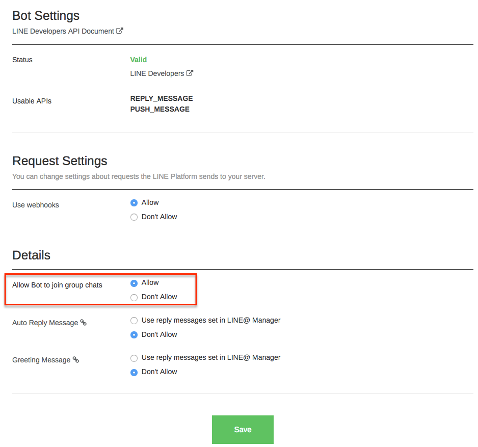

### How can I get the user IDs of the users of a group or a room?

It's not currently possible to get the user IDs of the individual members of a group or room. You can only get the user IDs of users in 1-on-1 chats.

### Why can't I get the user IDs of the users of a group or a room?

We currently don't provide this information because we value our users' privacy. Although your bot may have been invited to a group or a room, not all users in the group or room may have agreed to provide you with their profile information. We understand that it would be convenient if you were able to get the user IDs and we are currently working on a way to resolve this issue.

### How can I find out the number of users in a group or a room?

It's not currently possible to get information about the number of users in a group or a room.

### How can I get the name and profile image of a group?

It's not currently possible to get the name and profile image of a group.

### Can I get events for when a user joins or leaves a group?

No. Events are not sent when a user joins or leaves a group or a room that your bot is in. The `join` and `leave` webhook events are delivered only when your bot joins a group or a room.

## LINE Beacon

### How do I get a LINE Beacon?

You can purchase a LINE Beacon from this [beacon shop website](https://beacon.theshop.jp/items/4699062).

### How can I use LINE Beacon with my bot?

You can configure LINE Beacon with your bot through the beacon configuration page on the [LINE@ Manager](https://admin-official.line.me/beacon/register#/).

### How can I use the `banner` value of the `beacon.type` property as shown in the beacon event object documentation?

The "Beacon Banner" feature is only available to people using the "Business Connect" plan. If you are interested in using this feature, please make an inquiry through the [LINE Partner website](https://partner.line.me).

### What are the specifications of LINE Beacon?

Please see the following blog post for more information about the LINE Beacon specifications: https://engineering.linecorp.com/ja/blog/detail/89 (only available in Japanese).

## Channel Console (LINE Developers)

### Do I have to set an IP address on the server IP whitelist page?

No, you are not required to set an IP address on the server IP whitelist. For security reasons, you can register server IP addresses to restrict access to specific servers.

### Why do I get an error when I click the "Verify" button for the webhook URL in the "Basic information" page?

The value of the reply token, which is returned in a webhook when the "Verify" button is clicked, is invalid. This causes an error to occur as the reply endpoint cannot be successful called. To resolve this issue, set a valid webhook URL that supports SSL. 

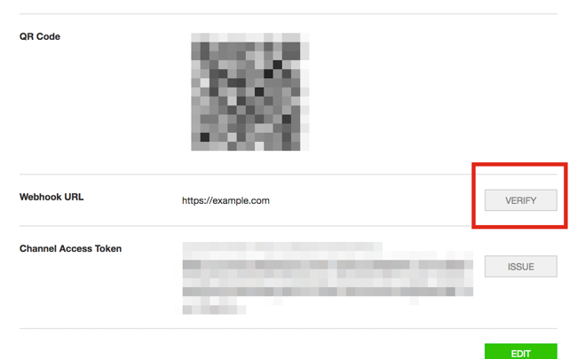

### How do I get a new Channel access token?

To get a new Channel access token, click the "Issue" button on the "basic information" page in the Channel Console. 

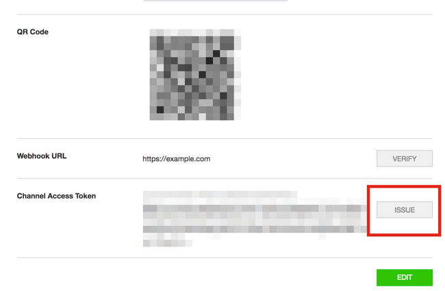

When you click the "Issue" button a dialog box like the one shown below opens. You can then set the number of hours your existing Channel access token can be used for. After that time, your existing Channel access token will become invalid.

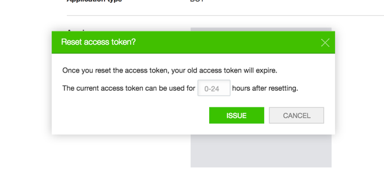

### What's the difference between short-term and long-term Channel access tokens?

Short-term Channel access tokens are only available to partners using Business Connect and LINE@ Pro users. All other users can only use long-term Channel access tokens which are issued from the Channel Console.

## LINE@ Manager settings

### Why can't I receive webhook events?

Your account may not have been set up to allow webhooks. To enable webhooks, select "Allow" under the "Use webhooks" option in the "Bot settings" page in the LINE@ Manager.

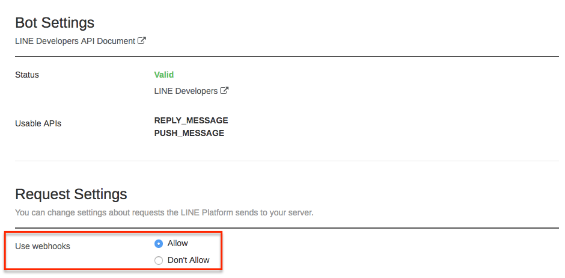

### Why does my bot automatically send replies?

You may have the "auto reply message" feature enabled in the LINE@ Manager. To disable this feature, select "Don't allow" under the "Auto reply message" option in the "Bot settings" page in the LINE@ Manager.

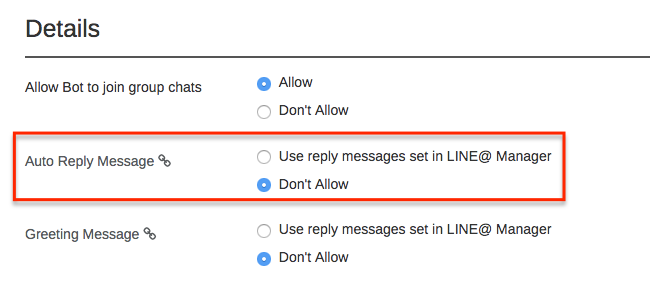

### How can I display a rich menu in the chat?

Rich menus let users send text or URLs by tapping an image on a menu in the chat. 

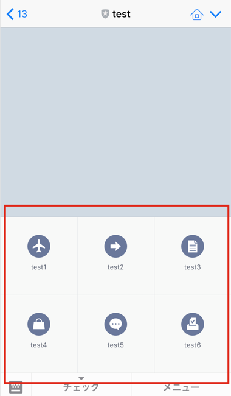

You can display a rich menu by going to the "Rich menu" page under the "Create rich content" page in the LINE@ Manager. Click "Create New" to design the rich menu by uploading images to the LINE@ Manager and mapping them to text or URLs.

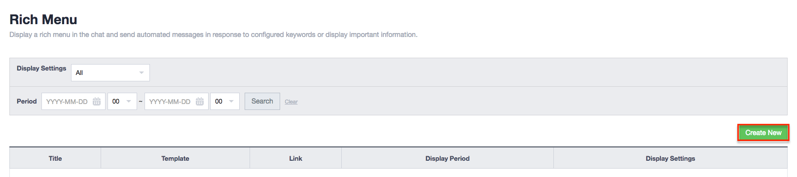

## Types of plans

### Can I change my account to the "Developer Trial" plan?

You cannot change an account to the "Developer Trial" plan. To use the "Developer Trial" plan you must create a new account. If you want to use `push` messages in production, you can use the LINE@ Pro plan. For more information on the types of plans available, see [Messaging API](https://business.line.me/en/services/bot). Please note that the plans available may vary depending on your country.

### What's the difference between the "Free" and "Basic" plans (only applies to accounts in Japan)?

There is no difference as it relates to the Messaging API. (https://business.line.me/ja/services/bot) To learn about the differences in LINE@ features, see [LINE@ plans](http://at.line.me/jp/plan).

## Sending messages

### Why can't I use the `push` endpoint to send messages to users?

Your plan may not include the PUSH_MESSAGE permission. You can check your permissions in the "Bot Settings" section of the LINE@ Manager as shown in the image below. To get the PUSH_MESSAGE permission you can use the "Developer Trial" plan or you can select a paid plan that supports push messages. For more information about the type of plans available, see [Messaging API](https://business.line.me/services/bot).

Note that you cannot change your existing account to the "Developer Trial" plan. You must create a new account.

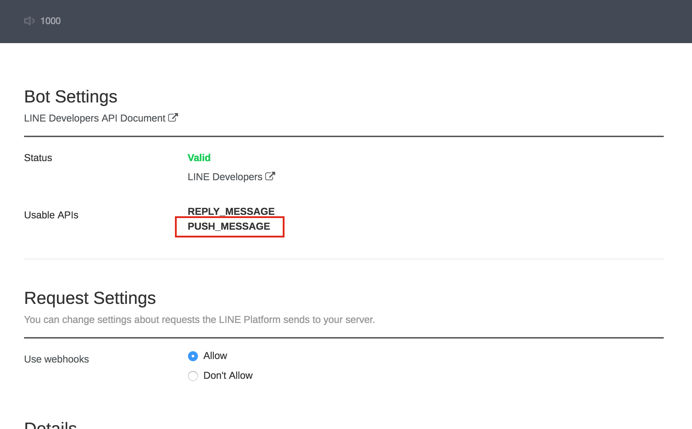

### How do I send messages to multiple users?

Use the [`multicast`](https://devdocs.line.me/en/#multicast) endpoint to send messages to multiple users. Note that you must be subscribed to the "Developer Trial" plan or a paid plan that supports the `push` endpoint to use `multicast`. Also note that you cannot use `multicast` to send messages to groups or rooms.

### How do I send a message to all of my bot's friends at the same time?

You can send broadcast messages to all of your bot's friends from the "Compose" page in the LINE@ Manager. Alternatively, you can call the `multicast` endpoint multiple times.

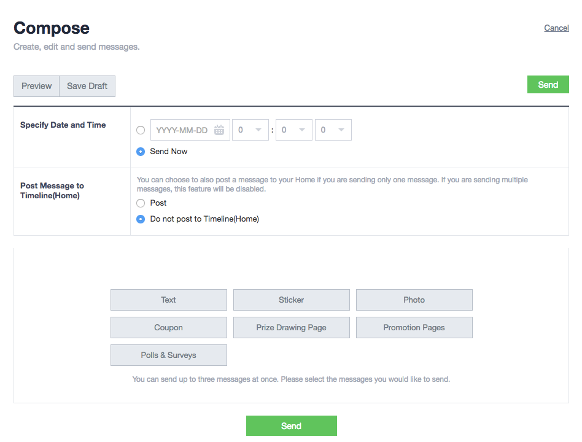

## Hypermedia

### Why do I only see text when I send template messages?

Template messages are currently only supported on iOS and Android devices. Only the "alt text" will appear for all other devices.

### Why aren't the images in my imagemap message displaying properly?

Make sure that your image URLs follow the correct format as specified in the [imagemap documentation](https://devdocs.line.me/en/#imagemap-message) quoted below. Note that the image will not display if you add a filename extension to the URL such as `https://example.com/images/cats/700.png`.

> To use an imagemap, you must include URLs with the image width (px) at the end of the base URL so that the client can download the image at the required resolution.
>
> For example, if the base URL is, `https://example.com/images/cats` the URL for a client device to download a 700px image would be `https://example.com/images/cats/700`.

### Do audio files have to use the M4A file extension?

Only M4A files are supported on the Messaging API. If a service only supports MP3 files, you can use a service like FFmpeg to convert the files to M4A.

### How can I get the image of a sticker that a user sends to my bot?

Unfortunately, it's not possible to get the image of stickers sent by users. You can only get the `packageId` and `stickerId` values for stickers sent by users.

### Why can't I save or forward videos that are sent from my bot?

This feature is not supported on the Messaging API. Users can only play videos that are sent from a bot, they cannot download or forward the videos to other users.

## Other

### Do webhook requests have to be handled asynchronously?

No, webhook requests don't have to be handled asynchronously. This may be necessary for official accounts with a large number of friends but it is not required for regular bots. Since you don't need to use a queue server for handling requests asynchronously, you can use a simple web server for your bot.

### If a webhook delivery fails, will LINE retry sending the webhook?

No, LINE does not retry the connection after a failure.

### How do I get the `userId`, `groupId`, and `roomId` values?

You can get them through webhooks. You can easily get the `userId` from follow event objects and can get `groupId` and `roomId` from join event objects.

Alternatively, you can get a user's `userId` by using [LINE Login](https://developers.line.me/line-login/overview).

### Is the user ID (`userId`) different from the LINE ID?

The user ID is different from the LINE ID. The LINE ID is used by users on the LINE app to search for other users while the user ID is used to identify users when using APIs. The user ID is found in webhook event objects and profile objects.

Note: Make sure you use the user ID and not the LINE ID when you want to send a message to users through the Messaging API.

### Why do I get different user IDs (`userId`) with my different accounts (Channels)?

Your accounts may belong to different *companies* (or *enterprises*) in the [LINE Business Center](https://business.line.me). User IDs are unique for each company that you create. This means that you cannot use the same user IDs for two accounts that belong to different companies. However, you can use user IDs across multiple accounts as long as they belong to the same company.

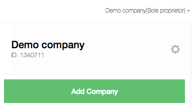

### Do I need to have a server to create a LINE bot?

Yes, you need to have a server with a SSL certificate to communicate with the LINE Platform. You can get free SSL certifcates using a service such as Let's Encrypt or StartSSL. It's also possible to try out the LINE Bot SDK using Heroku or another similar cloud service.

### Do I need to use SSL on my server?

Yes, you have to use SSL on your server. Also note that self-signed certificates are not acceptable. If you encounter issues related to your SSL configuration, you should check that your SSL certificate chain is complete and that your intermediate certificates are correctly installed on your server.

### Can I use the LINE Bot SDK in localhost?

No, our platform needs to be able to send events to your server over the internet.

### How can I get a user's time zone information?

There is currently no way of getting a user's time zone information.

### Can I send messages to Timeline?

No, we currently do not support sending messages to Timeline.